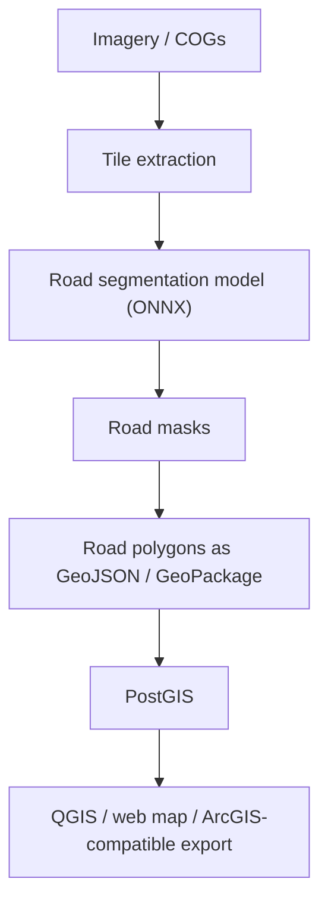

# GeoAI Road Detection Platform

GeoAI pipeline for detecting roads from aerial or satellite imagery and publishing the
results as GIS-ready vector data.

Roads are linear networks, so this repo is set up around **semantic segmentation** rather
than bounding-box object detection:



## What This Sets Up

- Extract georeferenced image tiles from a GeoTIFF or Cloud Optimized GeoTIFF.
- Run an ONNX road segmentation model against each tile.
- Convert binary road masks into GeoJSON or GeoPackage polygons.
- Optionally load detected roads into PostGIS.

## Suggested Model Path

Start with a road segmentation model trained on one of these label sources:

- SpaceNet roads
- Massachusetts Roads Dataset
- OpenStreetMap-derived labels for your area of interest
- Your own manually QA'd road polygons or masks

Recommended model families:

- U-Net / U-Net++
- DeepLabV3+
- SegFormer

Export the trained model to ONNX with an RGB input shaped like `[1, 3, H, W]` and a
single road mask output, or a two-class background/road output.

## Setup

```powershell
python -m venv .venv
.\.venv\Scripts\Activate.ps1
python -m pip install --upgrade pip
pip install -r requirements.txt
```

Optional PostGIS:

```powershell
docker compose up -d postgis
```

## Configure

Copy `config/roads.example.yaml` to a local config file and update:

- `imagery.source`: path to your COG or GeoTIFF
- `model.path`: path to your exported road segmentation `.onnx` model
- `project.processing_crs`: projected CRS used for area filtering and simplification
- `project.output_crs`: CRS written to the final vector output
- `inference.threshold`: road probability cutoff, commonly `0.4` to `0.6`
- `vectorization.min_area_m2`: remove tiny false-positive fragments

## Run

```powershell
geoai-roads tile --config config/roads.example.yaml
geoai-roads infer --config config/roads.example.yaml
geoai-roads vectorize --config config/roads.example.yaml
```

Or run the local file pipeline in one command:

```powershell
geoai-roads run --config config/roads.example.yaml
```

Load into PostGIS:

```powershell
geoai-roads load-postgis --config config/roads.example.yaml
```

## Outputs

Default outputs are ignored by git:

- `data/tiles/`: extracted georeferenced image chips
- `outputs/road_masks/`: binary road masks
- `outputs/roads.gpkg`: vectorized road polygons

Open `outputs/roads.gpkg` in QGIS to inspect detections. For web or ArcGIS exports, change
`vectorization.output` to `outputs/roads.geojson` and use an appropriate output CRS such as
`EPSG:4326`.

## Notes For Road Detection

- Use segmentation instead of YOLO boxes for the main road extraction.
- Use overlap during tiling so roads crossing tile boundaries are less likely to break.
- Tune the threshold and minimum polygon area per imagery source.
- For production centerlines, add a thinning/skeletonization step after mask generation,
  then snap and clean the resulting network in PostGIS or QGIS.
