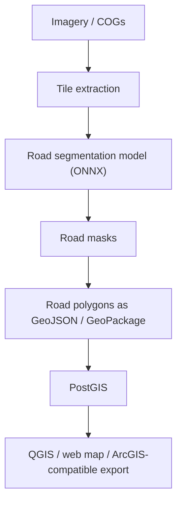

# GeoAI Road Detection Platform

GeoAI pipeline for detecting roads from aerial or satellite imagery and publishing the
results as GIS-ready vector data.

Roads are linear networks, so this repo is set up around **semantic segmentation** rather
than bounding-box object detection:



## What This Sets Up

- Extract georeferenced image tiles from a GeoTIFF or Cloud Optimized GeoTIFF.
- Run an ONNX road segmentation model against each tile.
- Convert binary road masks into GeoJSON or GeoPackage polygons.
- Optionally load detected roads into PostGIS.
- Define and run up to 10 configured GeoAI workflows from one catalog.
- Expose workflow execution through a REST API with an interactive `/docs` UI.

## Related Documentation

These links assume this repo sits next to the status board repo in the same parent
folder.

- [Geospatial Status Board README](../geospatial-status-board/README.md) - Grails,
  MapLibre, GeoServer, and PostGIS status-board app.
- [Geospatial Status Board Architecture](../geospatial-status-board/docs/geospatial-architecture.md)
  - map, GeoServer, PostGIS, and GeoAI integration notes.

## Suggested Model Path

Start with a road segmentation model trained on one of these label sources:

- SpaceNet roads
- Massachusetts Roads Dataset
- OpenStreetMap-derived labels for your area of interest
- Your own manually QA'd road polygons or masks

Recommended model families:

- U-Net / U-Net++
- DeepLabV3+
- SegFormer

Export the trained model to ONNX with an RGB input shaped like `[1, 3, H, W]` and a
single road mask output, or a two-class background/road output.

## Setup

```powershell
python -m venv .venv
.\.venv\Scripts\Activate.ps1
python -m pip install --upgrade pip
pip install -r requirements.txt
```

To generate local demo imagery and a tiny ONNX model for the default example
workflow:

```powershell
python -m pip install -e ".[demo]"
python scripts/create_demo_assets.py
```

The generated files are written to ignored local paths:

- `data/imagery/example-cog.tif`
- `models/road-segmentation.onnx`

The demo model is intentionally simple and only proves the pipeline mechanics. Replace
it with a trained segmentation model before using detections for real analysis.

### Fetch Real New Mexico Imagery

For more realistic pipeline testing, fetch a small 2022 NAIP COG sample near
Albuquerque, New Mexico:

```powershell
python scripts\fetch_new_mexico_cog.py
```

This queries the Microsoft Planetary Computer NAIP STAC collection, crops a
manageable subset from the selected public NAIP COG, and writes:

- `data/imagery/new-mexico-naip-abq-cog.tif`

The matching workflow config is:

- `config/roads.new-mexico.example.yaml`

Optional PostGIS:

```powershell
docker compose up -d postgis
```

The example config defaults to the local PostGIS service from the sibling
`geospatial-status-board` repo (`gsb:gsb@localhost:5432/geostatusboard`) so
detected roads can be loaded and published by that app's GeoServer stack. If you
use this repo's standalone PostGIS service instead, copy the config and point
`postgis.url` at your local database.

## Configure

Copy `config/roads.example.yaml` to a local config file and update:

- `imagery.source`: path to your COG or GeoTIFF
- `model.path`: path to your exported road segmentation `.onnx` model
- `project.processing_crs`: projected CRS used for area filtering and simplification
- `project.output_crs`: CRS written to the final vector output; the example uses
  `EPSG:4326` for GeoServer WFS and web maps
- `inference.threshold`: road probability cutoff, commonly `0.4` to `0.6`
- `vectorization.min_area_m2`: remove tiny false-positive fragments

## Run

```powershell
geoai-roads tile --config config/roads.example.yaml
geoai-roads infer --config config/roads.example.yaml
geoai-roads vectorize --config config/roads.example.yaml
```

Or run the local file pipeline in one command:

```powershell
geoai-roads run --config config/roads.example.yaml
```

Load into PostGIS:

```powershell
geoai-roads load-postgis --config config/roads.example.yaml --if-exists replace
```

This writes `public.detected_roads` with a `geom` geometry column and the source
CRS preserved, so GeoServer can publish it as a WFS layer for MapLibre.

## Run Multiple Workflows

Use `config/workflows.example.yaml` as the catalog for multiple GeoAI workflow
definitions. Each workflow points to a road-detection config file, so you can keep
different imagery, model, threshold, output, and PostGIS settings separate.

Run every enabled workflow in the catalog:

```powershell
geoai-roads run-workflows --catalog config/workflows.example.yaml
```

Run selected workflows:

```powershell
geoai-roads run-workflows --catalog config/workflows.example.yaml --workflow roads-local
```

Run the New Mexico NAIP sample workflow:

```powershell
geoai-roads run-workflows --catalog config/workflows.example.yaml --workflow roads-new-mexico-local
```

Load the New Mexico NAIP sample into the status-board PostGIS layer:

```powershell
geoai-roads run-workflows --catalog config/workflows.example.yaml --workflow roads-new-mexico-postgis
```

Override the stages for the selected workflows:

```powershell
geoai-roads run-workflows --catalog config/workflows.example.yaml --stage infer --stage vectorize
```

## REST API And Interactive UI

Start the API server:

```powershell
geoai-roads serve --host 127.0.0.1 --port 8000 --catalog config/workflows.example.yaml
```

For direct browser clients, set allowed origins with:

```powershell
$env:GEOAI_CORS_ORIGINS="http://localhost:8080,http://127.0.0.1:8080,http://localhost:18088,http://127.0.0.1:18088"
```

Open the interactive API UI at:

```text
http://127.0.0.1:8000/docs
```

The manual form in `/docs` uses dropdowns for fixed choices such as request
source and workflow stages. External apps submit the same JSON body to `POST /runs`.
Use `GET /run-options` to populate dropdown values in another app or a custom GUI.
The Geospatial Status Board map uses its Grails `/geoAi/*` same-origin proxy, which
forwards to this API and avoids browser CORS issues.

Useful endpoints:

- `GET /health`
- `GET /workflows`
- `GET /run-options`
- `POST /runs`
- `GET /runs`
- `GET /runs/{run_id}`

Example run request body:

```json
{
  "request_source": "manual",
  "submitted_by": "gis-operator",
  "external_request_id": null,
  "workflow_ids": ["roads-local"],
  "stages": ["tile", "infer", "vectorize"],
  "notes": "Run from the manual API form."
}
```

External app example:

```json
{
  "request_source": "external_app",
  "submitted_by": "asset-management-system",
  "external_request_id": "AMS-2026-00042",
  "model_id": "road-detection",
  "workflow_ids": ["roads-local"],
  "stages": ["tile", "infer", "vectorize"],
  "map_context": {
    "source_app": "geospatial-status-board",
    "bbox": [-107.0, 34.0, -106.0, 35.0],
    "map_center": [-106.5, 34.5],
    "zoom": 8,
    "selected_layer": "airportStatus",
    "selected_feature_ids": ["Kirtland AFB"]
  },
  "notes": "Submitted from upstream work order."
}
```

## Outputs

Default outputs are ignored by git:

- `data/tiles/`: extracted georeferenced image chips
- `outputs/road_masks/`: binary road masks
- `outputs/roads.gpkg`: vectorized road polygons

Open `outputs/roads.gpkg` in QGIS to inspect detections. For web or ArcGIS exports, change
`vectorization.output` to `outputs/roads.geojson` and use an appropriate output CRS such as
`EPSG:4326`.

## Notes For Road Detection

- Use segmentation instead of YOLO boxes for the main road extraction.
- Use overlap during tiling so roads crossing tile boundaries are less likely to break.
- Tune the threshold and minimum polygon area per imagery source.
- For production centerlines, add a thinning/skeletonization step after mask generation,
  then snap and clean the resulting network in PostGIS or QGIS.
