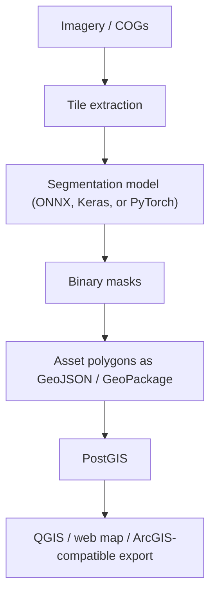
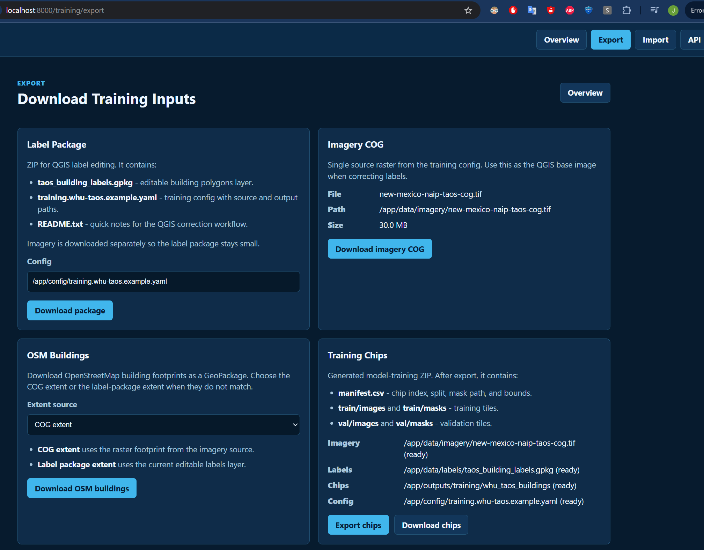

# GeoAI Asset Detection Platform

GeoAI pipeline for detecting geospatial assets from aerial or satellite imagery and
publishing the results as GIS-ready vector data.

The current workflows use **semantic segmentation** rather than bounding-box object
detection:



## What This Sets Up

- Extract georeferenced image tiles from a GeoTIFF or Cloud Optimized GeoTIFF.
- Run an ONNX, Keras, or PyTorch segmentation model against each tile.
- Convert binary masks into GeoJSON or GeoPackage polygons.
- Optionally load detected features into PostGIS.
- Define and run up to 10 configured GeoAI workflows from one catalog.
- Expose workflow execution through a REST API with an interactive `/docs` UI.

## Repository Map

This repo provides the GeoAI workflow API and road-detection pipeline. The companion
status-board repo provides the Grails application, MapLibre map viewer, GeoServer
configuration, PostGIS stack, and geospatial architecture notes that consume GeoAI
outputs.

- [GeoAI Asset Detection Platform repo](https://github.com/JosephDillard/geoai-asset-detection-platform)
- [GeoAI Asset Detection Platform README](https://github.com/JosephDillard/geoai-asset-detection-platform/blob/main/README.md)
- [Geospatial Status Board repo](https://github.com/JosephDillard/geospatial-status-board)
- [Geospatial Status Board README](https://github.com/JosephDillard/geospatial-status-board/blob/master/README.md)
- [Geospatial Status Board Architecture](https://github.com/JosephDillard/geospatial-status-board/blob/master/docs/geospatial-architecture.md)

## Suggested Model Path

For a working open-source smoke test, use the WHU building segmentation workflow:

- Model: [`giswqs/whu-building-unetplusplus-efficientnet-b4`](https://huggingface.co/giswqs/whu-building-unetplusplus-efficientnet-b4)
- License: Apache-2.0
- Architecture: UNet++ with EfficientNet-B4
- Input: 3-channel RGB, 512x512 tiles
- Output: 2-class background/building mask
- Local config: `config/buildings.whu-taos.example.yaml`

For roads, start with a model trained on one of these label sources:

- SpaceNet roads
- Massachusetts Roads Dataset
- OpenStreetMap-derived labels for your area of interest
- Your own manually QA'd road polygons or masks

Recommended model families:

- U-Net / U-Net++
- DeepLabV3+
- SegFormer

Export a trained model to ONNX with an RGB input shaped like `[1, 3, H, W]` and a
single road mask output, or a two-class background/road output. The pipeline also
supports Keras `.keras`, `.h5`, and `.hdf5` models with RGB input shaped like
`[1, H, W, 3]`, plus PyTorch segmentation-models-pytorch weights.

The open-source road model currently configured for local testing is the
MIT-licensed Hugging Face Keras model
[`spectrewolf8/aerial-image-road-segmentation-with-U-NET-xp`](https://huggingface.co/spectrewolf8/aerial-image-road-segmentation-with-U-NET-xp).
The model card describes a U-Net-50 road-segmentation model trained with
256x256 patches from the Massachusetts Roads Dataset and demonstrates a `0.8`
prediction threshold. In Taos NAIP testing, this road model produced too few
useful features; the WHU building model is the current practical open-source demo.

## Setup

```powershell
python -m venv .venv
.\.venv\Scripts\Activate.ps1
python -m pip install --upgrade pip
pip install -r requirements.txt
```

To generate local demo imagery and a tiny ONNX model for the default example
workflow:

```powershell
python -m pip install -e ".[demo]"
python scripts/create_demo_assets.py
```

The generated files are written to ignored local paths:

- `data/imagery/example-cog.tif`
- `models/road-segmentation.onnx`

The demo model is intentionally simple and only proves the pipeline mechanics. Replace
it with a trained segmentation model before using detections for real analysis.

The generated demo COG uses projected meter-scale pixels. If you created demo assets
before this change and see very wide road polygons from `example-cog.tif`, rerun
`python scripts/create_demo_assets.py` so the local demo raster is regenerated.

### Use The Open-Source HF U-Net/Keras Model

Download the HF model into the ignored local `models/` directory:

```powershell
python scripts\download_hf_road_model.py
```

Install the optional Keras backend in a Python 3.10-3.12 environment:

```powershell
python -m pip install -e ".[dev,keras]"
```

TensorFlow is intentionally optional. The default ONNX/demo workflows continue to run
without it, and the Keras dependency is guarded so Python 3.13+ environments do not
try to install an unsupported TensorFlow wheel.

### Use The Open-Source WHU Building Model

Download the WHU building model into the ignored local `models/` directory:

```powershell
python scripts\download_hf_building_model.py
```

Install the optional PyTorch backend:

```powershell
python -m pip install -e ".[dev,pytorch]"
```

For the least-input developer path, use the Docker image from the companion status
board repo. It installs pytest/dev tooling, CUDA-enabled PyTorch by default, and
downloads the WHU model automatically. To build a CPU-only image instead, set
`GEOAI_PYTORCH_INDEX_URL=https://download.pytorch.org/whl/cpu` in the status-board
repo's `.env` before rebuilding the GeoAI image.

### Fetch Real New Mexico Imagery

For more realistic pipeline testing, fetch a small 2022 NAIP COG sample around
Taos, New Mexico:

```powershell
python scripts\fetch_new_mexico_cog.py
```

This queries the Microsoft Planetary Computer NAIP STAC collection, crops a
manageable subset from the selected public NAIP COG, and writes:

- `data/imagery/new-mexico-naip-taos-cog.tif`

The matching workflow config is:

- `config/roads.new-mexico.example.yaml`

Build footprints for the local COGs and load them into the status-board PostGIS:

```powershell
python scripts\load_cog_footprints.py
```

This writes `outputs/cog_footprints.gpkg` and loads
`public.geoai_cog_footprints`, which the status-board GeoServer can publish as
a map layer.

Optional PostGIS:

```powershell
docker compose up -d postgis
```

The example config defaults to the local PostGIS service from the sibling
`geospatial-status-board` repo (`gsb:gsb@localhost:5432/geostatusboard`) so
detected roads can be loaded and published by that app's GeoServer stack. If you
use this repo's standalone PostGIS service instead, copy the config and point
`postgis.url` at your local database.

### Docker Dev Runtime

For the recommended laptop setup, run GeoAI in Docker with Python 3.12 and
TensorFlow/Keras while the Grails status-board app continues to run from IntelliJ or
`bootRun`. On NVIDIA RTX laptops, the container requests one NVIDIA GPU and uses
CUDA-enabled PyTorch wheels by default. The companion `geospatial-status-board` repo
owns the shared local PostGIS/GeoServer Compose stack and includes a `geoai` profile
that builds this repo:

```powershell
cd ..\geospatial-status-board
.\dev.ps1 up-geoai
```

After changing the GeoAI Dockerfile or Python dependencies, rebuild explicitly:

```powershell
.\dev.ps1 build-geoai
.\dev.ps1 up-geoai
```

That starts:

- `gsb-postgis` on `localhost:5432`
- `gsb-geoserver` on `http://localhost:8081/geoserver`
- `gsb-geoai` on `http://localhost:8000`

The GeoAI container bind-mounts this repo's `src/`, `config/`, `scripts/`, and `sql/`
folders for a faster dev loop, plus the ignored `data/`, `models/`, `outputs/`, and
`logs/` directories for local artifacts. On first start it downloads the HF U-Net/Keras
model and fetches the Taos NAIP sample COG if they are missing. To disable either
startup download, set these Compose environment values to `false` in the status-board
`.env` file:

```text
GEOAI_DOWNLOAD_HF_MODEL=false
GEOAI_FETCH_SAMPLE_COG=false
```

Inside Docker, `GEOAI_POSTGIS_URL` points at the Compose service name `postgis`.
When running GeoAI directly on Windows, the YAML config still points at
`localhost:5432`.

## Configure

Copy `config/roads.example.yaml` to a local config file and update:

- `imagery.source`: path to your COG or GeoTIFF
- `model.path`: path to your segmentation `.onnx`, Keras, or PyTorch model
- `model.backend`: `onnx`, `keras`, or `pytorch`; omitted values are inferred from the model
  file suffix
- `asset.class_name`: class label written to vector outputs, such as `road` or `building`
- `project.processing_crs`: projected CRS used for area filtering and simplification
- `project.output_crs`: CRS written to the final vector output; the example uses
  `EPSG:4326` for GeoServer WFS and web maps
- `inference.threshold`: road probability cutoff, commonly `0.4` to `0.6`
- `inference.threshold_sweep`: optional list of thresholds to vectorize and load
  from saved probability rasters without rerunning the model
- `inference.input_sizes`: optional multi-scale model input sizes such as
  `[512, 640]`; probabilities are resized to the largest output and averaged
- `inference.preserve_model_resolution`: write masks at model-output resolution
  when it is higher than the source tile; useful with smaller source chips to reduce
  blocky building footprints
- `inference.save_probability` and `inference.probability_dir`: optionally save
  float32 probability rasters before thresholding, so model confidence can be
  inspected separately from the final binary mask
- `inference.augmentations`: optional test-time augmentation list such as
  `[none, hflip, vflip, hvflip]`; predictions are flipped back and averaged before
  thresholding
- `inference.average_overlaps`: average overlapping probability pixels from
  overlapping tiles before thresholding, reducing tile-edge artifacts and duplicate
  polygons
- `inference.mask_cleanup`: optional raster cleanup controls before polygonizing;
  `close_pixels` bridges tiny gaps, `fill_holes_pixels` fills small holes, and
  `remove_objects_pixels` removes tiny connected components
- `vectorization.min_area_m2`: remove tiny false-positive fragments
- `vectorization.smooth_tolerance_m`: optional geometry smoothing in projected meters
  to soften blocky raster-mask edges before loading into GIS
- `vectorization.rectangularize`: replace high-fill polygon masks with their minimum
  rotated rectangles; useful for reducing jagged WHU building footprints
- `vectorization.rectangularize_min_area_ratio`: minimum original-area-to-rectangle-area
  ratio required before rectangularization is applied
- `vectorization.dissolve_overlaps`: merge overlapping detections from overlapping
  tiles and then explode them back to separate polygon features
- `vectorization.regularize`: gently snap near-horizontal/vertical building edges
  to the footprint's dominant orientation while rejecting changes with excessive
  area drift
- `vectorization.max_source_pixel_size_m`: skip masks whose source pixel size is too
  coarse for road-surface extraction
- `vectorization.max_mask_coverage`: skip a tile when an implausibly large fraction
  of the mask is classified as road

The `GEOAI_POSTGIS_URL` environment variable overrides `postgis.url`, which is how
the Docker service targets the Compose PostGIS hostname without duplicating every
workflow config file.

## Run

```powershell
geoai-roads tile --config config/roads.example.yaml
geoai-roads infer --config config/roads.example.yaml
geoai-roads vectorize --config config/roads.example.yaml
```

Or run the local file pipeline in one command:

```powershell
geoai-roads run --config config/roads.example.yaml
```

Load into PostGIS:

```powershell
geoai-roads load-postgis --config config/roads.example.yaml --if-exists replace
```

This writes `public.detected_roads` with a `geom` geometry column and the source
CRS preserved, so GeoServer can publish it as a WFS layer for MapLibre.

## Run Multiple Workflows

Use `config/workflows.example.yaml` as the catalog for multiple GeoAI workflow
definitions. Each workflow points to a detection config file, so you can keep
different imagery, model, threshold, output, and PostGIS settings separate.

Run every enabled workflow in the catalog:

```powershell
geoai-roads run-workflows --catalog config/workflows.example.yaml
```

Run selected workflows:

```powershell
geoai-roads run-workflows --catalog config/workflows.example.yaml --workflow roads-local
```

Run the Taos NAIP sample workflow:

```powershell
geoai-roads run-workflows --catalog config/workflows.example.yaml --workflow roads-new-mexico-local
```

Load the Taos NAIP sample into the status-board PostGIS layer:

```powershell
geoai-roads run-workflows --catalog config/workflows.example.yaml --workflow roads-new-mexico-postgis
```

Run the HF U-Net/Keras New Mexico sample workflow:

```powershell
geoai-roads run-workflows --catalog config/workflows.example.yaml --workflow roads-hf-unet-new-mexico-local
```

Load the HF U-Net/Keras New Mexico sample into the status-board PostGIS layer:

```powershell
geoai-roads run-workflows --catalog config/workflows.example.yaml --workflow roads-hf-unet-new-mexico-postgis
```

Run the WHU building model against the Taos NAIP sample:

```powershell
geoai-roads run-workflows --catalog config/workflows.example.yaml --workflow buildings-whu-taos-local
```

Load WHU building detections into the status-board PostGIS layer:

```powershell
geoai-roads run-workflows --catalog config/workflows.example.yaml --workflow buildings-whu-taos-postgis
```

## Fine-Tune The Building Model

QGIS is the recommended open-source tool for correcting training labels. It is
not the training engine; it is where you edit polygons. The neural-network
training runs in this repo with PyTorch.

The no-login web training pages are available from the GeoAI service:

```text
http://localhost:8000/training
```

The export page groups the label package, source COG, OSM building download,
and chip export controls in one place:



Use `Export` to download a QGIS label package, download the imagery COG,
download OSM building footprints for the COG or label extent, or generate/download
training chips.
Use `Import` to upload corrected QGIS labels back into `data/labels`.

Suggested label loop:

1. Run the current WHU building workflow and inspect the output in the status-board
   map or QGIS.
2. In QGIS, create/correct building polygons over the Taos NAIP COG:
   `data/imagery/new-mexico-naip-taos-cog.tif`.
3. Save corrected polygons to:
   `data/labels/taos_building_labels.gpkg`
   with layer name `buildings`.
4. Export image/mask chips:

```powershell
geoai-roads export-training-chips --config config/training.whu-taos.example.yaml
```

or:

```powershell
python scripts\export_training_chips.py --config config/training.whu-taos.example.yaml
```

5. Fine-tune from the WHU checkpoint:

```powershell
geoai-roads train-building-model --config config/training.whu-taos.example.yaml
```

or:

```powershell
python scripts\train_building_model.py --config config/training.whu-taos.example.yaml
```

The example training config writes chips under
`outputs/training/whu_taos_buildings` and saves the best checkpoint to
`models/whu-building-unetplusplus-efficientnet-b4-taos-finetuned.pth`. After
training, point `config/buildings.whu-taos.example.yaml` at that checkpoint and
rerun the building workflow.

Override the stages for the selected workflows:

```powershell
geoai-roads run-workflows --catalog config/workflows.example.yaml --stage infer --stage vectorize
```

## REST API And Interactive UI

Start the API server:

```powershell
geoai-roads serve --host 127.0.0.1 --port 8000 --catalog config/workflows.example.yaml
```

For direct browser clients, set allowed origins with:

```powershell
$env:GEOAI_CORS_ORIGINS="http://localhost:8080,http://127.0.0.1:8080,http://localhost:18088,http://127.0.0.1:18088"
```

Open the interactive API UI at:

```text
http://127.0.0.1:8000/docs
```

The manual form in `/docs` uses dropdowns for fixed choices such as request
source and workflow stages. External apps submit the same JSON body to `POST /runs`.
Use `GET /run-options` to populate dropdown values in another app or a custom GUI.
The Geospatial Status Board map uses its Grails `/geoAi/*` same-origin proxy, which
forwards to this API and avoids browser CORS issues.

Useful endpoints:

- `GET /health`
- `GET /workflows`
- `GET /run-options`
- `POST /runs`
- `GET /runs`
- `GET /runs/{run_id}`

The local API currently runs one request at a time because the sample workflows
share configured tile, mask, and vector output paths. Add per-run workspaces before
raising API worker concurrency.

Example run request body:

```json
{
  "request_source": "manual",
  "submitted_by": "gis-operator",
  "external_request_id": null,
  "workflow_ids": ["roads-local"],
  "stages": ["tile", "infer", "vectorize"],
  "notes": "Run from the manual API form."
}
```

External app example:

```json
{
  "request_source": "external_app",
  "submitted_by": "asset-management-system",
  "external_request_id": "AMS-2026-00042",
  "model_id": "road-detection",
  "workflow_ids": ["roads-local"],
  "stages": ["tile", "infer", "vectorize"],
  "map_context": {
    "source_app": "geospatial-status-board",
    "bbox": [-107.0, 34.0, -106.0, 35.0],
    "map_center": [-106.5, 34.5],
    "zoom": 8,
    "selected_layer": "airportStatus",
    "selected_feature_ids": ["Kirtland AFB"]
  },
  "notes": "Submitted from upstream work order."
}
```

## Outputs

Default outputs are ignored by git:

- `data/tiles/`: extracted georeferenced image chips
- `outputs/*_masks/`: binary segmentation masks
- `outputs/*.gpkg`: vectorized asset polygons

Open the configured GeoPackage output in QGIS to inspect detections. For web or
ArcGIS exports, change `vectorization.output` to a `.geojson` path and use an
appropriate output CRS such as `EPSG:4326`.

## Notes For Road Detection

- Use segmentation instead of YOLO boxes for the main road extraction.
- Use overlap during tiling so roads crossing tile boundaries are less likely to break.
- Tune the threshold and minimum polygon area per imagery source.
- Treat the bundled ONNX model as a mechanics-only demo. On real NAIP imagery it can
  classify bright non-road surfaces as broad road blobs, so keep the quality filters
  enabled until a trained road model is supplied.
- Prefer `config/roads.hf-unet-new-mexico.example.yaml` for open-source road-model
  testing against the Taos NAIP sample. It uses 256x256 tiles, Keras NHWC input,
  and the model card's `0.8` threshold.
- For production centerlines, add a thinning/skeletonization step after mask generation,
  then snap and clean the resulting network in PostGIS or QGIS.
